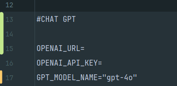
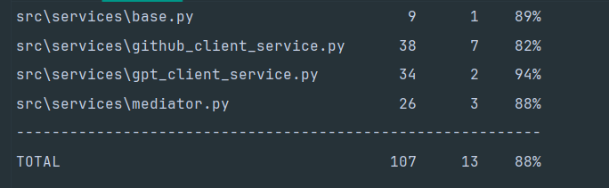

## Model and API Configuration

In this project, I used the **gpt-4o** model provided by [Inference AI](https://models.inference.ai.azure.com) instead of OpenAI, as OpenAI does not provide free access to its API.

If you need to change the API URL or switch to a different model, you can easily do so by updating the `.env_EXAMPLE` file.



---

## About Scaling

To ensure that the application can handle high loads and scale efficiently, the following techniques and tools have been employed:

### 1. **Load Balancing**
   - Use a **load balancer**, such as **Nginx**, to distribute incoming traffic evenly across multiple instances of the application.

### 2. **Horizontal Scaling**
   - For handling heavy traffic, **increase the number of workers** and **apply horizontal scaling**. This allows the system to scale across multiple servers.
   - **Autoscaling** (e.g., with **Kubernetes**) can be used to dynamically adjust the number of services based on the traffic load.

### 3. **Caching**
   - **Request caching** is implemented using **Redis** or **Memcached** to store frequently accessed data, reducing the need for redundant API calls and database queries.

### 4. **Monitoring**
   - **Prometheus** and **Grafana** are integrated for **system monitoring**. They provide real-time insights into the system's performance, helping to identify bottlenecks and optimize resource allocation.

### 5. **Log Aggregation**
   - **Elasticsearch** is used for **log aggregation**, enabling quick search and analysis of logs to identify and fix errors or bugs.

### 6. **DDoS Protection**
   - **Cloudflare** is implemented to protect the application from **DDoS attacks** and other malicious traffic, ensuring the security and stability of the system.

---

## Instructions 

1. Clone the repository:

   ```bash
   git clone https://github.com/0leksandrr/Auto-Review-Tool

2. Navigate to the project directory:
    ```bash
    cd Auto-Review-Tool

3. Start the application using Docker Compose:
    ```bash
   docker-compose up -d

4. Make a request to **localhost:8000/api/v1/review** with the following data:
    ```bash
    {
        "assignment_description": "",
        "github_repo_url": "",
        "candidate_level": ""
    }

## Test


## Response 
.png)